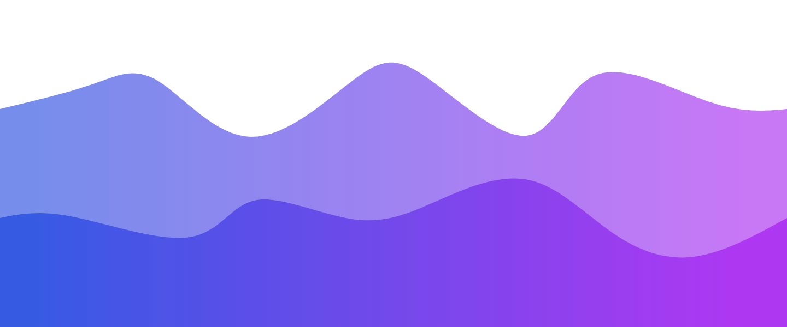

<h1 align="center">What's Up👋, I'm M.K.</h1>
<h3 align="center">A passionate austrian developer</h3>

  

- 🔭 I’m currently working on [Bot-Hosting-Wrapper](https://github.com/suspectedesp/bot-hosting-wrapper)

<!-- - 🌱 I’m currently learning **-**

- 👯 I’m looking to collaborate on [nothing](-)

- 🤝 I’m looking for help with - [nothing](-)
-->
- 👨‍💻 All of my python modules are available at [https://pypi.org/user/suspectedesp/](https://pypi.org/user/suspectedesp/)

- 📫 How to reach me: **Still needs to be set up**

- ⚡ Fun fact about me: **I'm active on Github since late 2022**

<h3 align="left">Connect with me:</h3>

<h3 align="left">Languages and Tools:</h3>

       

&nbsp;

